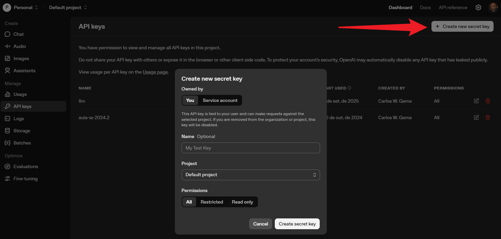

# SCRIPT LLM com  RAG (Retrieval-Augmented Generation) e servidor Express

Script montado para executar comandos na LLM do OpenAI e RAG, porém com facilidade de migração, uma vez que foi utilizado o LangChain no processo. 

## Tecnologias Envolvidas:
LLM:
- NodeJS
- Lagchain 
- OpenAI 

Servidor:
- Express


-----
## Configuração


#### Etapa 1 - Criar a Key do OpenAI
Inicialmente, para configurar o projeto é preciso ir o OpenAI, criar uma conta e criar uma chave de acesso ao modelo do OpenAI:

Link: [https://platform.openai.com/api-keys](https://platform.openai.com/api-keys)



#### Etapa 2 - Baixar o Projeto

Instale pelo pacote NPM:
```bash
npm install carloswgama/cwg-llm-openai
```

Ou baixe o projeto do GitHub e instale as dependências:
```bash
git clone https://github.com/CarlosWGama/cwg-llm-openai ./projeto
cd projeto
npm install
```

#### Etapa 3 - Setar as variáveis de ambiente

Crie um arquivo .env no seu projeto
Nesse arquivo você deve informar:

```bash
CWG_LLM_OPENAI_KEY=<sua api key copiada da etapa 1>
CWG_LLM_OPENAI_MODEL=<A versão do modelo que irá usar como 'gpt-4.1-nano', 'gpt-3-turbo'...>
CWG_LLM_OPENAI_EMBEDDING=<modelo do embedding usado para o rag como 'text-embedding-ada-002', 'text-embedding-3-large' ou 'text-embedding-3-small'	>
```

Exemplo:
```bash
CWG_LLM_OPENAI_KEY=sk-proj-Lr8XNcasdas11vHRl9gBQnpSe2-D0pP2kOBy_q7PsoCTasdasdgyfvOTTPKzH30WWGmOzcf_6PNbJ89D8jd8Ja8j2j92d
CWG_LLM_OPENAI_MODEL=gpt-4.1-nano
CWG_LLM_OPENAI_EMBEDDING=text-embedding-ada-002
```

Fique atendo aos custos dos modelos. Abaixo segue algumas informações dos custoas a cada 1 milhão de tokens:

| Modelo | Preço  |   Tipo |
|--------|--------|--------|
| gpt-5 | $1.25| LLM |
| gpt-5-mini| $0.25 | LLM |
| gpt-5-nano | $0.05 | LLM |
| gpt-4.1 | $2.00 | LLM |
| gpt-4.1-mini	 | $0.40 | LLM |
| gpt-4.1-nano	 | $0.10 | LLM |
| gpt-3-turbo	 | $8.00 | LLM |
| text-embedding-3-small | $0.02 | Embedding (RAG) |
| text-embedding-3-large | $0.13 | Embedding (RAG) |
| text-embedding-ada-002 | $0.10 | Embedding (RAG) |

Lista completa dos preços [preços](https://platform.openai.com/docs/pricing)

#### Etapa 4 - Rodando os Scripts 

##### Exemplo de Rodar o Script Diretamente

primeira importe as funções que deseja executar:

```js
const { ask, askFromPrompt, askFromURL, askFromPDF, askFromEmbedding, saveEmbedding } = require('cwg-llm-openai');
```

###### Exemplo de um comando básico
Exemplo mais básico do uso da IA sem conhecimento extra passado. Todo conhecimento é o do modelo.

```js
const { ask } = require('cwg-llm-openai');

async function exemplo() {
    const resposta = await ask('Quem é Carlos W. Gama?');
    console.log(resposta);
}
```

###### Exemplo passando um contexto (RAG básico)
Esse tipo de cenário é ideal quando você quer adicionar informações ao conhecimento da LLM, que vem de uma base própria sua. 
```js
const { askFromPrompt } = require('cwg-llm-openai');

async function exemplo() {
    //Informação tirada de alguma fonte
    context = 'Carlos W. Gama é um programador';
    const resposta = await askFromPrompt('Quem é Carlos W. Gama?', context);
    console.log(resposta);
}
```

###### Exemplo passando uma fonte de URL (RAG da Web)
Esse cenário faz com que a informação buscada de uma página web e convertido para uma base de dados vetorial, de forma com a LLM consiga consultar as informações. 

Nessa etapa é usado o Embedding do OpenAI, que serve para criar o Retriever.
O Embbeding é a representação numérica de seus dados (textos, documentos, etc.) em um formato que o computador consegue entender e comparar.
O embedding padrão usado é o text-embedding-ada-002, que possui um custo de $0.10 a cada 1 Milhão de tokens. 

```js
const { askFromURL } = require('cwg-llm-openai');

async function exemplo() {
    //Informação tirada de alguma fonte
    url = 'https://carloswgama.com.br';
    const resposta = await askFromURL('Quem é Carlos W. Gama?', url);
    console.log(resposta);
}
```

###### Exemplo passando uma fonte de PDF (RAG de documento)
Esse cenário faz com que a informação buscada de um arquivo em PDF. É o cenário ideal de quando você já tem um arquivo pdf com o todo o conhecimento da empresa ou regras de negócios que necessita que a LLM conheça. 

Também utiliza o Embedding do OpenAI para criar o retriever da base de dados vetorial.

```js
const { askFromPDF } = require('cwg-llm-openai');

async function exemplo() {
    //Informação tirada de alguma fonte
    caminho_pdf = './src/example/doc.pdf';
    const resposta = await askFromPDF('Quem é Carlos W. Gama?', caminho_pdf);
    console.log(resposta);
}
```

###### Exemplo passando uma consulta direto de uma base vetorial
Caso deseje, pode salvar um dado passado em RAG para depois consultá-lo diretamente sem precisa converter novamente o arquivo para uma base númerica. O dado fica salvo no seu computador. 
```js
const { askFromURL, askFromPDF, askFromEmbedding } = require('cwg-llm-openai');

async function consulta_salvando() {
    //Informação tirada de alguma fonte
    url = 'https://carloswgama.com.br';
    arquivoRAG = 'nome_indice';
    const resposta = await askFromURL('Quem é Carlos W. Gama?', url, arquivoRAG);
    //const resposta = await askFromPDF('Quem é Carlos W. Gama?', 'documento.pdf', salveRAG);
    console.log(resposta);
}

async function consulta_embedding() {
    //Informação tirada direto de uma base convertida
    arquivoRAG = 'nome_indice';
    const resposta = await askFromEmbedding('Quem é Carlos W. Gama?', arquivoRAG);
    console.log(resposta);
}
```

Ou caso deseja, pode salvar o arquivo antes para consultá-lo depois

```js
const { saveEmbedding, askFromEmbedding } = require('cwg-llm-openai');

async function save() {
    const arquivoRAG = 'nome_indice';
    
    //Exemplo do URL
    const url = 'https://carloswgama.com.br';
    await saveEmbedding(url, null, arquivoRAG);

    //Exemplo com PDF
    const documento = 'documento.pdf';
    await saveEmbedding(null, documento, arquivoRAG);
}

async function consulta_embedding() {
    //Informação tirada direto de uma base convertida
    arquivoRAG = 'nome_indice';
    const resposta = await askFromEmbedding('Quem é Carlos W. Gama?', arquivoRAG);
    console.log(resposta);
}
```

##### Exemplo de Rodar o projeto pelo Express

A baixo segue um exemplo de uma implementação rodando pelo ExpressJS. Deixando claro que é necessário ainda implementar regras de segurança como JWT para que não usem sua API sem sua permissão, consumindo seu créditos.

```js
const express = require('express')
const { ask, askFromPrompt, askFromURL, askFromPDF, askFromEmbedding } = require('cwg-llm-openai');

const app = express();
app.use(express.json());


//USO DA API SIMPLES
app.get('/api/simples', async (req, res) => {

    const pergunta = req.body.pergunta
    if (!pergunta) return res.status(400).json({erro: 'Faltando pergunta'})
    
    console.log('Mensagem', req.body.pergunta);
    const resposta = await ask(pergunta);
    // Envia uma resposta de sucesso de volta
    res.status(201).json({ resposta });
});

//USO DA API PASSANDO CONTEXTO
app.get('/api/context', async (req, res) => {

    const pergunta = req.body.pergunta
    if (!pergunta) return res.status(400).json({erro: 'Faltando pergunta'})

    console.log('Mensagem', req.body.pergunta);
    const resposta = await askFromPrompt(pergunta, 'Carlos W. Gama é quem criou esse projeto!');
    // Envia uma resposta de sucesso de volta
    res.status(201).json({ resposta });
});


//USO DA API USANDO RAG COM URL
app.get('/api/url', async (req, res) => {

    const pergunta = req.body.pergunta
    if (!pergunta) return res.status(400).json({erro: 'Faltando pergunta'})

    console.log('Mensagem', req.body.pergunta);
    const resposta = await askFromURL(pergunta, 'https://carloswgama.com.br');
    // Envia uma resposta de sucesso de volta
    res.status(201).json({ resposta });
});


//USO DA API USANDO PDF
app.get('/api/pdf', async (req, res) => {

    const pergunta = req.body.pergunta
    if (!pergunta) return res.status(400).json({erro: 'Faltando pergunta'})
        
    console.log('Mensagem', req.body.pergunta);
    const resposta = await askFromPDF(pergunta, './src/example/doc.pdf', 'caminho_embedding');
    // Envia uma resposta de sucesso de volta
    res.status(201).json({ resposta });
});

//USO DA API USANDO EMBEDDING
app.get('/api/embedding', async (req, res) => {

    const pergunta = req.body.pergunta
    if (!pergunta) return res.status(400).json({erro: 'Faltando pergunta'})

    console.log('Mensagem', req.body.pergunta);
    const resposta = await askFromEmbedding(pergunta, 'caminho_embedding');
    // Envia uma resposta de sucesso de volta
    res.status(201).json({ resposta });
});


app.listen(3000, () => console.log('Servidor Rodando'))
```

-------
Autor: Carlos W. Gama
Licença: MIT